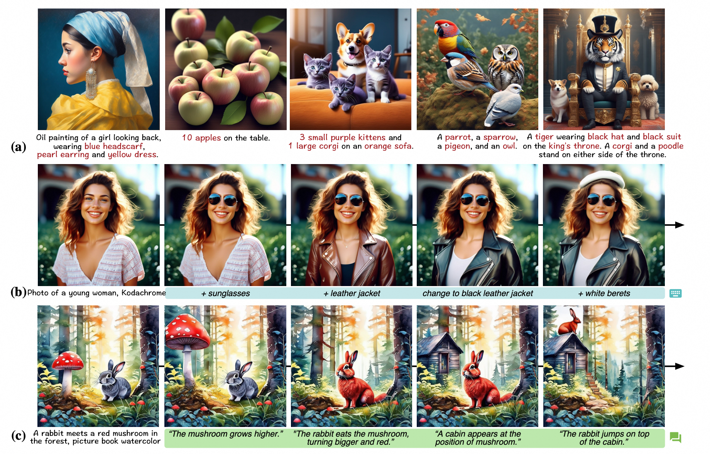
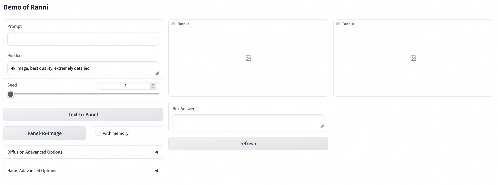
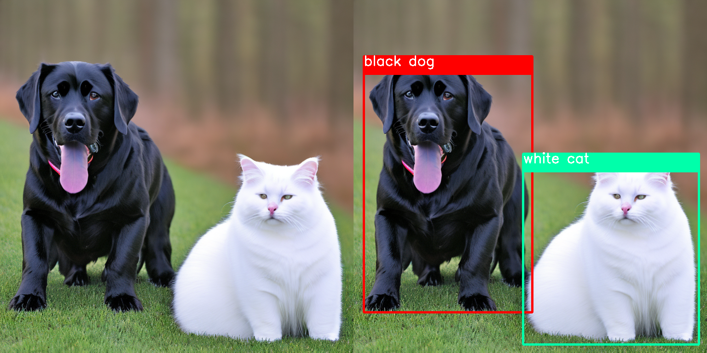
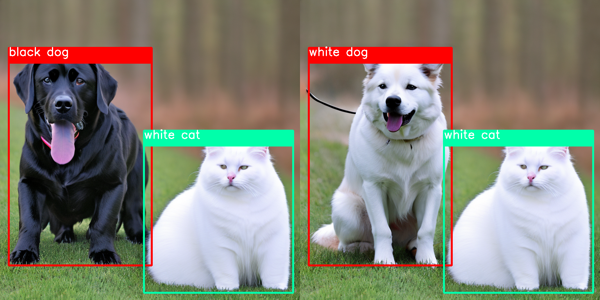
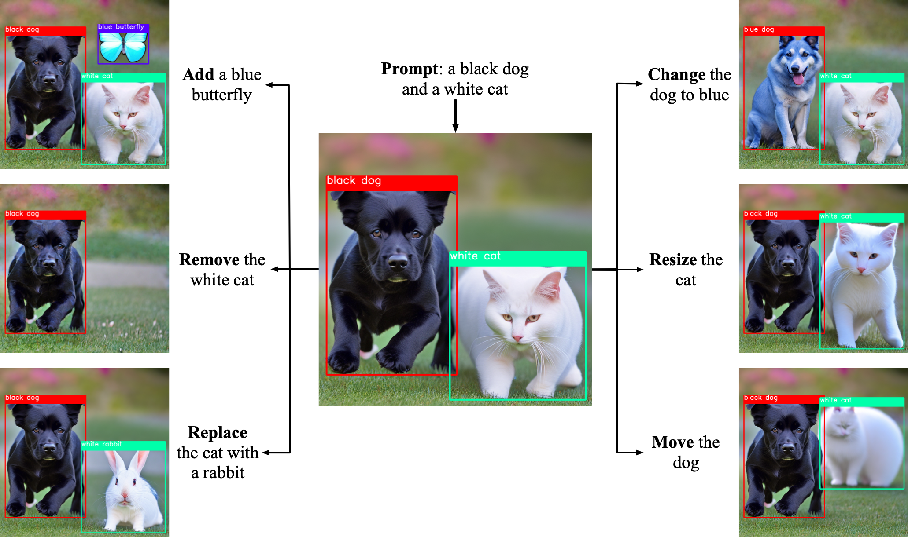

<p align="center">

  <h2 align="center">Ranni: Taming Text-to-Image Diffusion for Accurate Prompt Following</h2>
  <p align="center">
    <a href="https://scholar.google.com/citations?user=mZwJLeUAAAAJ"><strong>Yutong Feng</strong></a>
    ·
    <a href="https://scholar.google.com/citations?user=BwdpTiQAAAAJ"><strong>Biao Gong</strong></a>
    ·
    <a href="https://di-chen.me/"><strong>Di Chen</strong></a>
    ·
    <a href="https://shenyujun.github.io/"><strong>Yujun Shen</strong></a>
    ·
    <a href="https://scholar.google.com/citations?user=8zksQb4AAAAJ&hl=zh-CN"><strong>Yu Liu</strong></a>
    ·
    <a href="https://scholar.google.com/citations?user=64zxhRUAAAAJ"><strong>Jingren Zhou</strong></a>
    <br>
    <br>
        <a href="https://arxiv.org/abs/2311.17002"></a>
        <a href='https://ranni-t2i.github.io/Ranni/'></a>
    <br>
    <b>Alibaba Group &nbsp; | &nbsp;  Ant Group </b>
  </p>

  This repository is the official implementation of CVPR 2024 paper "Ranni: Taming Text-to-Image Diffusion for Accurate Instruction Following". It contains two main components: 1) a LLM-based planning model that maps text instructions into visual elements in image, 2) a diffusion-based painting model that draws image following the visual elements in first stage. Ranni achieves better semantic understanding thanks to the powerful ability of LLM. Currently, we release the model weights including a LoRA-finetuned LLaMa-2-7B, and a fully-finetuned SDv2.1 model.
  
  <table align="center">
    <tr>
    <td>
      
    </td>
    </tr>
  </table>

## News
- **2024 4.8**: Ranni is accepted as CVPR 2024 oral paper 🎉
- **2024 4.3**: We release the v1 code of Ranni.

## TODO List
- [x] Release model, checkpoint and demo code.
- [ ] Support more conditions.
- [ ] Chatting-based editing.
- [ ] Continuous generation with ID-consistency.


## Installation
Install with `conda`: 
```bash
conda env create -f environment.yaml
conda activate ranni
```


## Download Checkpoints
Download Ranni [checkpoints](https://modelscope.cn/models/yutong/Ranni/files) and put all files in `model` dir, which should be like:
```
models/
  llama2_7b_lora_bbox.pth
  llama2_7b_lora_element.pth
  ranni_sdv21_v1.pth
```

## Gradio demo 
We present the interactivate image generation by running the gradio demo:

```bash
python demo_gradio.py
```

It should look like the UI shown below:

<table align="center">
  <tr>
  <td>
    
  </td>
  </tr>
</table>

### Tutorial for image generation
Simply type in the image prompt. Click the button `text-to-panel` for generate semantic panel, then click the button `panel-to-image` for generate corresponding image:

> prompt: A black dog and a white cat
<table align="center">
  <tr>
  <td>
    
  </td>
  </tr>
</table>


### Tutorial for continuous editing
After generating an image, you could modify the box answer to adjust the panel (modify the prompt if needed). Click button `refresh` to refresh the condition. Enable the checkbox `with memory` after the `panel-to-image`, then generate the modified image:

> prompt: A panda wearing a red hat on the grass
> modification: red hat -> blue hat

<table align="center">
  <tr>
  <td>
    
  </td>
  </tr>
</table>

By operating on the boxes and prompts, you could achieve multiple editing operations in following types:
<table align="center">
  <tr>
  <td>
    
  </td>
  </tr>
</table>

## Acknowledgement
This repository is based on the following codebases:
* https://github.com/Stability-AI/stablediffusion
* https://github.com/lllyasviel/ControlNet/

## Citation
If you find this codebase useful for your research, please use the following entry.
```BibTeX
@article{feng2023ranni,
  title={Ranni: Taming Text-to-Image Diffusion for Accurate Instruction Following},
  author={Feng, Yutong and Gong, Biao and Chen, Di and Shen, Yujun and Liu, Yu and Zhou, Jingren},
  journal={arXiv preprint arXiv:2311.17002},
  year={2023}
}
```